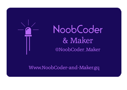

  

  
  

Noob maker and Python, HTML, CSS, C and JavaScript coder on the block. Hopefully adding the projects that I hope to create over the coming few months,and maybe even years! We will be experimenting with electronics including my Raspberry Pi's, Arduino Uno, Micro:bit and others, writing code predominantly using Python for the Pi and C with the Arduino IDE. I also intend to do some dabling with Microsoft Visual Studio 2017 community edition.

 [Here's my NoobCoder-And-Maker.gq Website!](http://noobcoder-and-maker.gq)

See my experiments with the CamJam EduKit 1 and 2 at my other Github website.
## [Here's my NoobCoder-CamJam-Adventures.gq Go Go GO!](http://noobcoder-camjam-adventures.gq)
 
 What about my blog, over at.
## [NoobCoder-And-Maker-Blog.gq!](http://noobcoder-and-maker-blog.gq)

And finally :- My twiter feed is over at.
## [@NoobCoder_Maker](https://twitter.com/NoobCoder_Maker)
